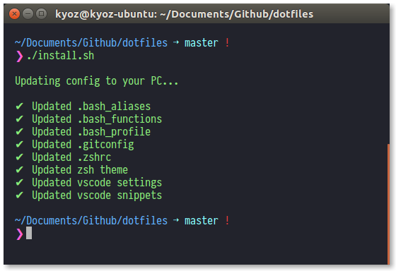

# Kyoz's dotfiles
dotfiles to configurating my working enviroment :cat:

  

## Dotfiles

| File                 | Description                                                               |
|:---------------------|:--------------------------------------------------------------------------|
| .bash_aliases        | Aliases for my most used commands                                         |
| .bash_functions      | Some helpful functions                                                    |
| .bash_profile        | Config system aliases, git aliases, nvm...                                |
| .gitconfig           | Config infomation, aliases for git                                        |
| .zshrc               | Config for oh-my-zsh                                                      |
| purify.zsh-theme     | [Purify theme](https://github.com/banminkyoz/purify) for oh-my-zsh        |
| purify.itermcolors   | Iterm2 colorscheme                                                        |

## Configs

| Folder          | Description                                                               |
|:--------------- |:--------------------------------------------------------------------------|
| vscode          | Settings & Keybindings & Snippets for VSCode                                         |

## Usage

* `install.sh` - Execute to automatically update dotfiles & configs to your PC
* `sync.sh` - Execute to sync dotfiles & configs from your PC to this project

## Related

* [Purify Theme](https://github.com/banminkyoz/purify)

## Lisence

MIT © [Kyoz](mailto:banminkyoz@gmail.com)